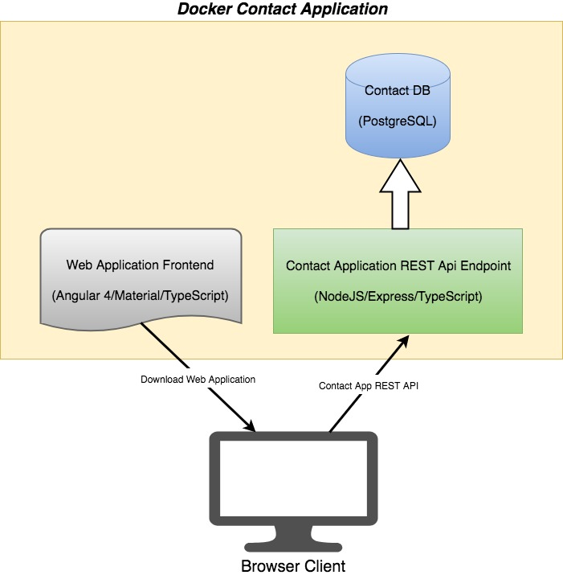
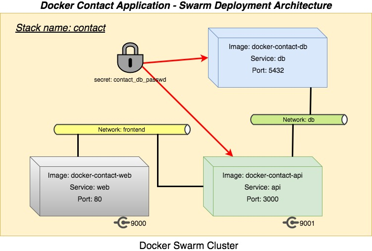

Docker Meetup HK 2017 July - Demo Contact Application
-----------------------------------------------------

## Application Description
This is a simple contact management application that allows users to add/update/delete contacts information from a web browser frontend. The application include the following components:

### Database
The contact information is stored in a PostgreSQL DB. There is a database called "contact" and table called "contact" which store contact information.

### REST Api backend
The contact application contains a REST Api component which expose all contact related operations via various REST endpoints. The application was developed with the following tools and language:
* NodeJS (please use Node version 7.*)
* Express
* TypeScript

### Web Frontend
The frontend is a web application for users to view and manage contact information. It was developed with the following framework and language:
* Angular (version 4)
* Angular Material (version 2 beta)
* Angular CLI
* TypeScript

During deployment, the web application will be served by a Nginx server.

The following diagram illustrates the components within the contact application:

## Docker Swarm Deployment Architecture

The components in the contact application will be deployed as Docker containers onto a Docker Swarm cluster. The following diagram illustrates the deployment setup:

## Modules
There are 3 modules within this application:

| Module | Folder | Instructions |
| ------ | ------ | ------------ |
| DB | docker-contact-db | [./docker-contact-db/README.md](./docker-contact-db/README.md) |
| API | docker-contact-api | [./docker-contact-api/README.md](./docker-contact-api/README.md)  |
| Web | docker-contact-web | [./docker-contact-web/README.md](./docker-contact-web/README.md) |

## Application instructions (start/stop)
* Refer to the README file in folder docker-contact-app
